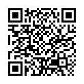
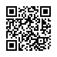
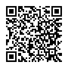
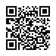
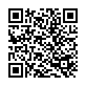

[](#android-developer-verification)
[](#)
[](#)
[](#)

[](https://github.com/jimvixx/ShortMessageSecure/releases)
[](https://github.com/jimvixx/ShortMessageSecure/actions/workflows/ci.yml)
[](https://github.com/jimvixx/ShortMessageSecure/releases)
[](LICENSE)

[](#)
[](#)

[//]: # ([![F-Droid]&#40;https://img.shields.io/badge/F--Droid-coming%20soon-informational?logo=f-droid&#41;]&#40;#&#41;)

[//]: # ([![IzzyOnDroid]&#40;https://img.shields.io/badge/IzzyOnDroid-available-blueviolet&#41;]&#40;https://android.izzysoft.de/&#41;)

<h1 align="center">Short Message Secure (SMSecure)</h1>

<p align="center"></p>

SMSecure is a privacy-focused SMS application that lets you communicate securely with your contacts using encrypted text messages.

---

## 🎯 Project Goals

SMSecure is a fork of:
- Silence: https://github.com/SilenceIM/Silence
- TextSecure (now Signal): https://github.com/WhisperSystems/TextSecure

The project aims to preserve encrypted SMS functionality that was removed from TextSecure.

Key goals:
- Maintain SMS encryption support
- Keep the codebase modern and up to date
- Integrate relevant bug fixes and improvements from upstream projects

---

## 📱 Simple & Familiar

SMSecure works like any standard SMS app:
- No account required  
- No registration  
- No additional services your contacts need to join  

Just install and start messaging.

---

## 🚫 Block Unwanted Messages

Stay in control of your inbox.

SMSecure allows you to block messages from:
- Unknown senders  
- Alphanumeric senders (messages that come from names instead of phone numbers, often used by services or spam)  

This helps reduce spam and unwanted notifications.

---

## 💾 Backup & Restore

Easily create backups of your messages:
- Supports encrypted backups  
- Simple restore process  

Your data stays safe and under your control.

---

## 🔍 Global Message Search

Quickly find any message across all conversations using built-in global search.

---

## 🔒 Private & Secure

SMSecure provides strong privacy guarantees:

- End-to-end encryption for SMS messages  
- No servers involved — communication happens directly via SMS  
- All messages are encrypted locally  
- No tracking
- No analytics
- No ads
- Local-only data processing
- No internet connection required (except when explicitly initiated by the user to send non-personal debugging information)

Even if your device is lost or stolen, your messages remain protected.

Security features include:
- Signal encryption protocol  
- Identity verification (QR code, hex fingerprint, Base64 fingerprint)  
- Protection against man-in-the-middle (MITM) attacks  

SMSecure does **not** collect or transmit any user data.

See [Privacy Policy](./PRIVACY_POLICY.md)

---

## 📖 Open Source

SMSecure is Free and Open Source software.

Anyone can audit the code to verify its security and privacy guarantees.

---

## 📦 Installation & Google Play Protect

SMSecure is distributed outside of Google Play.

Because of this, **Google Play Protect may show a warning, request additional scanning, or in some cases block installation**. This can happen even if the application is safe, simply because it was not installed from Google Play.

### What to do

- Make sure you downloaded the APK from the official source:
    - https://github.com/jimvixx/ShortMessageSecure/releases
- Review the Play Protect warning carefully
- If installation is blocked, you may need to:
    - temporarily disable **"Scan apps with Play Protect"**
    - install the app
    - re-enable Play Protect afterwards

### Why this happens

Play Protect applies stricter checks to apps installed from outside Google Play.  
SMSecure does **not** use Google Play distribution, so it may be treated as an unknown application by the system.

---

## 🔐 Security Verification

### ✅ Android Developer Verification

Package name:

org.jimvixx.smsecure

Status:

Verified

### 🔑 Official signing certificate (SHA-256)

```text
FA:3A:00:75:00:6D:56:DD:5E:7B:F9:FA:5F:83:55:63:BF:7D:71:6A:82:19:7A:28:96:17:14:D0:6F:72:AE:01
```

You can verify it with:

```bash
apksigner verify --print-certs SMSecure-<version>.apk
```

### 🧾 Verify APK checksum

Download both the APK and `SHA256SUMS.txt` from the release page, then run:

```bash
sha256sum -c SHA256SUMS.txt
```
Expected result:

```bash
SMSecure-<version>.apk: OK
```

---

## 🤝 Contributing

See [CONTRIBUTING.md](./CONTRIBUTING.md) for guidelines on contributing code, translations, or bug reports.

---

## 🛠️ Building

See [BUILDING.md](./BUILDING.md) for instructions on how to build SMSecure locally.

---

## ♥️ Donate

If you'd like to support development and help keep SMSecure maintained and improved, consider donating:

| Service                                                                        | Remark                       | QR Code                                                                                                                                      | Wallet                                                                                            |
|--------------------------------------------------------------------------------|------------------------------|----------------------------------------------------------------------------------------------------------------------------------------------|---------------------------------------------------------------------------------------------------|
|  BTC      |                              | <div align="center"><a href="graphics/donations-qr/btc.png"></a></div>   | `bc1pf95ekd0z3psj0tayzhldw548l88t2p2l3n5gahhewrnmfflspyrqvp0hrg`                                  |
|  ETH     | ETH (USDT ERC20, USDC ERC20) | <div align="center"><a href="graphics/donations-qr/eth.png"></a></div>   | `0xC188aE3a7CDCbc803Eb2da3B8a8Ce0ccF7aAa976`                                                      |
|  SOL       | Solana/Tokens                | <div align="center"><a href="graphics/donations-qr/sol.png"></a></div>   | `DLjGuAWT2msGs26Jp7XZL8VHyvaA2mAzRszb1trwRFfk`                                                    |
|  DOGE   |                              | <div align="center"><a href="graphics/donations-qr/doge.png"></a></div> | `DCPTtgez8t88TpMRseH39pMyEnAkQhTUKn`                                                              |
|  XMR       | Monero                       | <div align="center"><a href="graphics/donations-qr/xmr.png"></a></div>   | `47jGTWhNgzkWGizUBBNeRnbNfmmw5WWsW4vJNguTYAJP448vUbMt1HaWNB8pmoqBkrFYV7oY8hC7C4gf9dr4biLzDSwbbQd` |
|  LTC     |                              | <div align="center"><a href="graphics/donations-qr/ltc.png"></a></div>   | `ltc1q9su2ma3y83gp7n86c20ucr26ze9m6zfrg7z7ha`                                                     |
|  TRX      | TRON (TRX, USDT TRC20)       | <div align="center"><a href="graphics/donations-qr/trx.png"></a></div>   | `TWH1tr6zr7aPz41gG2Hj7kzm4o9a3SN7dy`                                                              |
|  BCH  |                              | <div align="center"><a href="graphics/donations-qr/bch.png"></a></div>   | `qrqf6psxknrhhr3xeq5xqmkler7h7t5a0ygfq9c4la`                                                      |

---

## ⚖️ Legal Notice

This distribution includes cryptographic software.

Laws regarding the use, import, and export of encryption may vary by country.  
Please ensure compliance with your local regulations before using this software.

More information: http://www.wassenaar.org/

---

## 📄 License

Licensed under GPLv3:  
http://www.gnu.org/licenses/gpl-3.0.html

---

## 🔗 Links

➡️ Source Code: https://github.com/jimvixx/ShortMessageSecure

---

